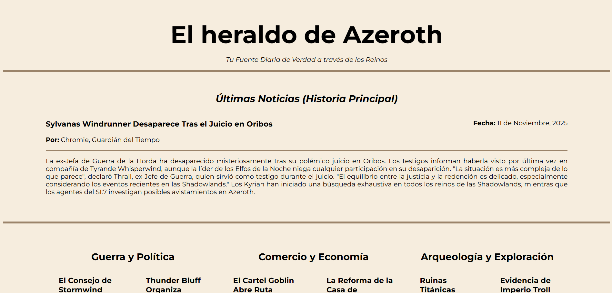

# Newspaper Layout

## Objetivo
Crear la maquetación de un periódico sencillo, enfocándose en la organización de la información.

## Tecnologías
- HTML
- CSS

## Detalles
- Diseño sin responsive
- Uso de grids y flexbox para la estructura

## Cómo ver
Abrir `index.html` en el navegador

## Captura
