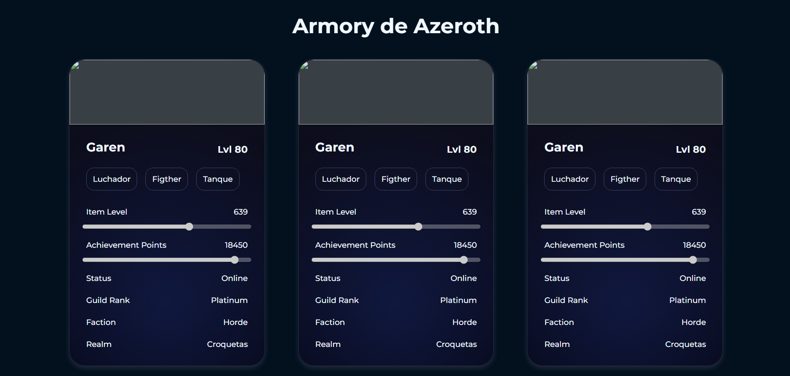

# Newspaper Layout

## Objetivo
Crear la maquetación de cartas de estadísticas para un videojuego usando HTML semántico y CSS básico, practicando la correcta estructuración de contenido y la separación de estilos.

## Tecnologías
- HTML
- CSS

## Detalles
- Diseño sin responsive
- Uso de flexbox para la estructura

## Cómo ver
Abrir `index.html` en el navegador

## Captura
