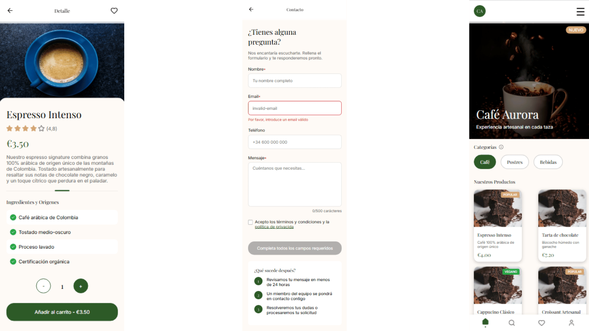

# Cafe Aurora - Mobile Mockup

## Objetivo
Recrear la maquetación de una página web para la cafetería **Cafe Aurora** a partir de un diseño en Figma, enfocándose en **dispositivos móviles**.

## Tecnologías
- HTML5
- CSS3
- Flexbox
- Diseño basado en mockup de Figma

## Detalles Técnicos
- Diseño estático solo para móvil.
- Uso correcto de la semántica HTML según el mockup
- Secciones: portada, menú, contacto y pie de página
- Énfasis en mantener la estética y distribución del diseño original

## Cómo ver
Abrir `index.html` en el navegador.

## Captura
