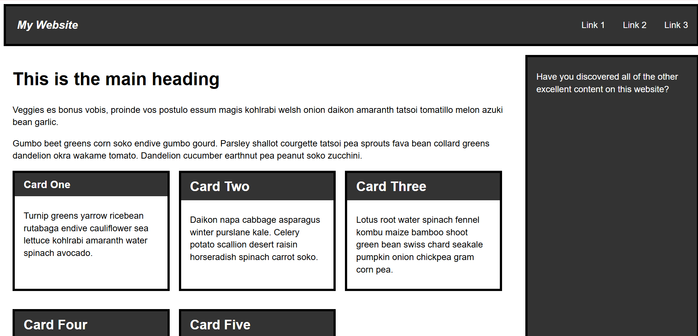
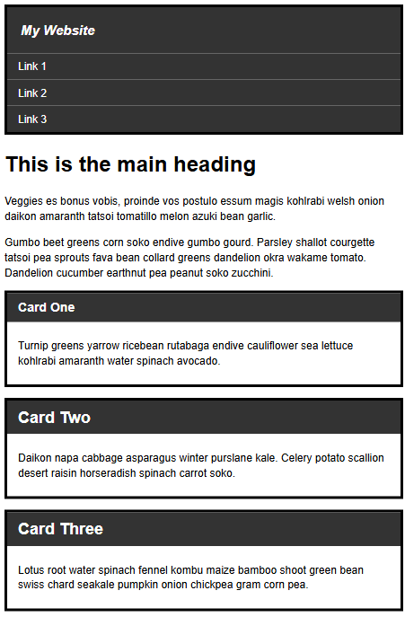

# Responsive Semantic Layout

## Objetivo
Desarrollar una página web con especial atención a la **semántica HTML**, el **diseño responsive** y la organización eficiente de estilos mediante variables CSS.

## Tecnologías
- HTML5
- CSS3
- Flexbox
- Media Queries
- CSS Custom Properties (`:root`)

## Detalles técnicos
- Estructura HTML clara y accesible.
- Diseño completamente responsive,
- Uso de CSS Custom Properties (`:root`) para colores, tamaños y espaciados
- Separación clara entre estructura y presentación.
- Código organizado y mantenible
- Variables y nomenclatura **BEM** para organizar clases de forma consistente

## Enfoque de aprendizaje
- Buenas prácticas de semántica.
- Escalabilidad y mantenimiento del CSS mediante variables globales.
- Adaptabilidad del diseño a distintos dispositivos.

## Cómo ver
Abrir `index.html` en el navegador y redimensionar la ventana.

## Capturas

