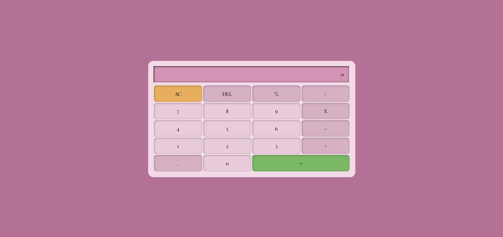

# Calculadora Responsive (Solo Maquetación)

## Objetivo
Diseñar y estructurar la interfaz de una calculadora completamente responsive.

Este proyecto **no incluye funcionalidad en JavaScript**, ya que el objetivo principal fue practicar la construcción de un sistema de layout responsive utilizando únicamente HTML y CSS.

## Tecnologías
- HTML5
- CSS3
- Flexbox
- Media Queries
- CSS Custom Properties (`:root`)

## Detalles Técnicos

- Sistema de columnas propio con variables CSS y clases reutilizables
- Diseño responsive adaptado a:
  - Mobile (por defecto)
  - Tablet (`@media (width > 768px)`)
  - Desktop (`@media (width > 1024px)`)
- Clases específicas por breakpoint: `.col-md-*`, `.col-lg-*`
- Estructura modular y escalable.
-Variables y nomenclatura **BEM** para organizar clases de forma consistente

## Enfoque de Aprendizaje
- Creación de un sistema de grid personalizado sin frameworks.
- Uso avanzado de `calc()` y variables CSS.
- Organización escalable y mantenible del CSS.
- Construcción de layouts responsive desde cero.

## Cómo ver el proyecto
Abrir `index.html` en el navegador y redimensionar la ventana.

## Capturas
