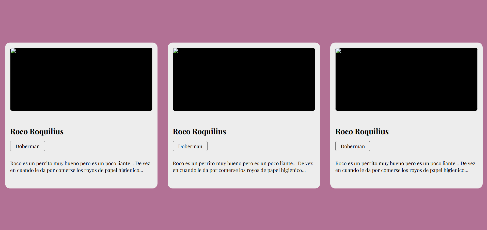

# Responsive Dog Cards Grid - Página Responsive

## Objetivo
Diseñar y maquetar una página de **cards** de perros completamente responsive. 

Este proyecto **no incluye funcionalidades dinámicas**, el objetivo principal fue practicar la construcción de layouts flexibles y responsivos usando solo HTML y CSS.

## Tecnologías
- HTML5
- CSS3
- Flexbox
- Media Queries
- CSS Custom Properties (`:root`)

## Detalles Técnicos

- Sistema de filas y columnas basado en Flexbox
- Cards independientes con alineación y espaciado consistentes
- Layout modular y escalable gracias a variables CSS
- Diseño responsive adaptado a:
  - Mobile (por defecto)
  - Tablet (`@media (width > 768px)`)
  - Desktop (`@media (width > 1024px)`)
- Clases específicas por breakpoint: `.col-md-*`, `.col-lg-*`
- Estructura modular y escalable.
- Variables y nomenclatura **BEM** para organizar clases de forma consistente

## Enfoque de Aprendizaje

- Construcción de layouts flexibles sin frameworks
- Uso de CSS variables para mantener consistencia y facilitar mantenimiento
- Maquetación responsive basada en Flexbox y media queries
- Organización modular del código HTML y CSS

## Cómo ver el proyecto
Abrir `index.html` en un navegador y redimensionar la ventana.

## Capturas
